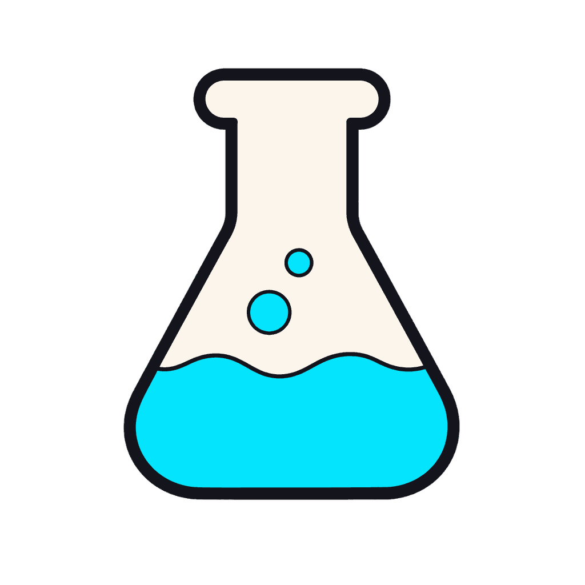
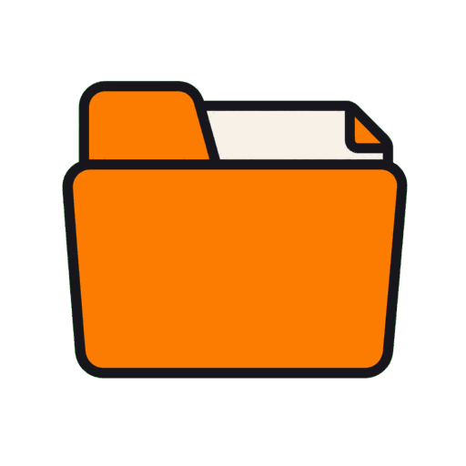
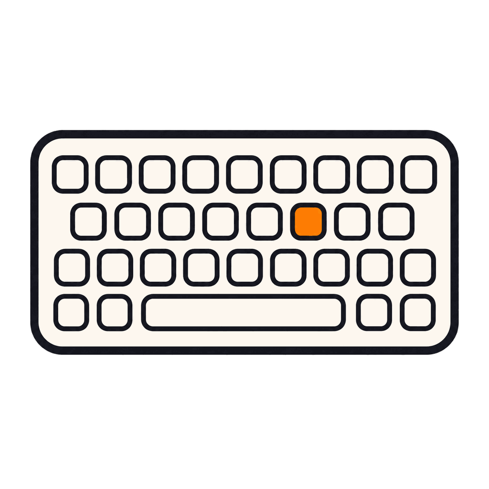

<p align="center">
  
</p>

<p align="center">
  
  <h1 align="center">Paperling</h1>
</p>

<p align="center">
  <strong>A no-setup Markdown reader and editor.</strong> Open any <code>.md</code> file and read it beautifully, edit with live preview (math, chemistry, and diagrams as you type), and use an optional free AI that proposes edits you accept or reject inline. No vaults, no plugins, no heavy app. Built with Tauri, React, and TypeScript.
</p>

<p align="center">
  <a href="https://github.com/Razee4315/Paperling/releases/latest"></a>
  <a href="https://github.com/Razee4315/Paperling/releases"></a>
  <a href="https://github.com/Razee4315/Paperling/stargazers"></a>
  
  <a href="LICENSE"></a>
  
</p>

<p align="center">
  <a href="https://github.com/Razee4315/Paperling/releases/latest"><b>⬇ Download</b></a> ·
  <a href="https://razee4315.github.io/Paperling/"><b>Website</b></a> ·
  <a href="#features"><b>Features</b></a> ·
  <a href="CONTRIBUTING.md"><b>Contribute</b></a>
</p>

<p align="center">
  
</p>

## Why Paperling?


As a developer, I frequently work with markdown files for documentation, notes, and project READMEs. The frustration of opening `.md` files in Notepad or basic text editors, only to see raw, unformatted text with all the symbols and syntax cluttering the content, inspired me to build Paperling.

I wanted something you just open and write in: it renders Markdown beautifully while keeping the raw text one keystroke away. Tools like Obsidian are powerful, but vaults, graphs, and plugins are overkill if you only want to open a file and edit it. Paperling stays out of that complexity and adds the things I actually reach for: math and chemistry that render live, and an optional free AI (bring your own model) that proposes edits you accept or reject right in the text.

<br clear="right">

> The little paper fellow above lives inside the app too: it greets you on the welcome screen, gives you a 30-second tour on first launch, and naps in the corners of empty panels.

## Screenshots

**Math, chemistry, diagrams, and code — all rendered live as you type.**

<p align="center">
  
</p>

### Four themes

Dark, Light, Paper, and Dracula.

|                                   Dark                                   |                                   Light                                    |                                   Paper                                    |
| :----------------------------------------------------------------------: | :------------------------------------------------------------------------: | :------------------------------------------------------------------------: |
|  |  |  |

### File explorer &amp; command palette

|                                          File explorer                                          |                                  Command palette                                   |
| :---------------------------------------------------------------------------------------------: | :--------------------------------------------------------------------------------: |
|  |  |

## Features

###  Writing

- **Clean Interface** — minimal UI that stays out of your way
- **Reader / Code / Split view** — Ctrl+E to toggle, Ctrl+\\ for split with bidirectional scroll sync
- **Focus mode** — dim non-active lines so you can think
- **Typewriter mode** — caret stays vertically centered
- **Formatting toolbar** (toggleable) and shortcuts: Ctrl+B / Ctrl+I / Ctrl+K / Ctrl+/
- **Slash commands** — type `/` at line start for headings, lists, tables, math, mermaid, callouts, and more
- **Auto-pair** brackets, quotes, and code marks; **list/quote continuation** on Enter
- **Tab in tables** moves between cells; auto-creates new rows
- **Visual table editing**: a toolbar appears when the caret is in a table, with buttons to add or delete rows and columns, set column alignment, and tidy the layout
- **Find & Replace** (Ctrl+F / Ctrl+H) with regex and match counter
- **Smart paste** — URL → link, rich HTML → markdown, TSV → GFM table

###  Preview

- **GitHub Flavored Markdown** with task lists, tables, strikethrough
- **Code blocks** with syntax highlighting and one-click copy
- **Math** via KaTeX (`$inline$`, `$$block$$`) — loaded only when needed
- **Chemistry** via mhchem — `$\ce{2 H2 + O2 -> 2 H2O}$`, ions, isotopes, Kröger-Vink defects
- **Mermaid diagrams** (` ```mermaid `) — flowcharts, sequence, class, state, gantt, ER, mindmaps
- **Image lightbox** — click to zoom; lazy loading
- **Interactive task checkboxes** — toggling writes back to source
- **Heading anchors** with click-to-jump
- **Wikilinks** `[[other-file]]` resolve in the same folder
- **Frontmatter** rendered as an editable Properties card

###  AI assistant

<p align="center">
  
</p>

- **AI side panel** — open it from the **AI** button next to Export (or `Alt+J` / `⌘J`). A VS Code-style chat docked on the right; content reflows beside it.
- **Ask mode** — chat about the current document: summarize it, find something, ask questions. Answers stream in live.
- **Agent mode** — describe a change in plain language and the AI proposes edits. They appear as an **inline diff in the editor** (green added / red removed) which you **review and accept or reject** — per change, or all at once. Nothing is written until you approve.
- **Selection assist** — select text and press `Alt+J` / `⌘J` to rewrite, shorten, expand, continue, or translate it in place.
- **Bring your own model** — works with any OpenAI-compatible endpoint: OpenAI, Google Gemini (OpenAI-compat), Ollama, llama.cpp, and more. Configure it in **Settings → AI**; your API key is stored in the OS keychain.

###  Files & workflow

- **Command palette** (Ctrl+P) — search commands, files, headings, toggles
- **Cheatsheet** (`?`) — every shortcut categorized and searchable
- **Settings modal** (Ctrl+,) — sidebar nav with Appearance / Editor / AI / About
- **New File** (Ctrl+N) and **Save As** (Ctrl+Shift+S)
- **Auto-save** (optional, debounced) with status indicator
- **External-change detection** — reload or keep your version when the file changes outside the app
- **Recent files** on the welcome screen — missing files marked
- **Restore last opened file** on launch
- **File Explorer** with folder navigation
- **Outline pane** that follows the cursor

###  Customization

- **Four themes** — Dark, Light, Paper, Dracula
- **Five fonts** — Inter, Merriweather, Lora, Source Serif, Fira Sans
- **Three font sizes**
- **WCAG-friendly** — visible focus rings, `prefers-reduced-motion` respected

###  Platform

- **Native performance** — built with Tauri
- **Cross-platform** — Windows, macOS, Linux

##  Installation

Download the latest release from the [Releases](https://github.com/Razee4315/Paperling/releases) page.

### Available Formats

| Platform    | Formats                                    |
| ----------- | ------------------------------------------ |
| **Windows** | `.msi` installer · `.exe` (NSIS) installer |
| **macOS**   | `.dmg` (Apple Silicon)                     |
| **Linux**   | `.AppImage` · `.deb` · `.rpm`              |

> **Note:** builds aren't code-signed yet, so Windows SmartScreen or macOS
> Gatekeeper may warn on first launch. On Windows choose _More info → Run anyway_;
> on macOS right-click the app and choose _Open_. Auto-update packages are signed
> and verified before installing.

## Development

### Prerequisites

- [Node.js](https://nodejs.org/) (v18+)
- [Bun](https://bun.sh/) (recommended) or npm
- [Rust](https://www.rust-lang.org/tools/install)

### Setup

```bash
# Clone the repository
git clone https://github.com/Razee4315/Paperling.git
cd Paperling

# Install dependencies
bun install

# Run in development mode
bun run tauri dev

# Build for production
bun run tauri build
```

##  Keyboard Shortcuts

A few essentials — press `?` inside the app for the full searchable list.

| Action                  | Shortcut                           |
| ----------------------- | ---------------------------------- |
| Command palette         | Ctrl+P                             |
| Cheatsheet              | ?                                  |
| Settings                | Ctrl+,                             |
| New file                | Ctrl+N                             |
| Open file               | Ctrl+O                             |
| Save                    | Ctrl+S                             |
| Save As                 | Ctrl+Shift+S                       |
| Toggle Reader / Code    | Ctrl+E                             |
| Toggle Split view       | Ctrl+\\                            |
| File explorer / Outline | Ctrl+Shift+E / Ctrl+Shift+O        |
| Find / Replace          | Ctrl+F / Ctrl+H                    |
| Bold / Italic / Link    | Ctrl+B / Ctrl+I / Ctrl+K           |
| Toggle blockquote       | Ctrl+/                             |
| AI panel / assist       | Alt+J (Windows) · ⌘J (macOS/Linux) |

## Tech Stack

- **Frontend**: React, TypeScript, Tailwind CSS
- **Backend**: Rust, Tauri v2
- **Build**: Vite

## Contributing


Contributions are very welcome — code, docs, bug reports, or ideas.

- 🌱 **New here?** Browse [`good first issue`](https://github.com/Razee4315/Paperling/issues?q=is%3Aissue+is%3Aopen+label%3A%22good+first+issue%22) — small, scoped tasks to get started.
- 🗺️ See the [Roadmap](ROADMAP.md) for where Paperling is headed and where help is wanted.
- 📦 Want to help with distribution? See [`packaging/`](packaging/) (winget, Scoop, and more).
- 📋 Please read the [Contributing Guidelines](CONTRIBUTING.md) and [Code of Conduct](CODE_OF_CONDUCT.md) before opening a pull request.

Even a ⭐ helps others discover the project.

## Author

**Saqlain Abbas**  
Email: saqlainrazee@gmail.com  
GitHub: [@Razee4315](https://github.com/Razee4315)
Linkedin: [@saqlain.razee](https://www.linkedin.com/in/saqlainrazee/)

## License

Paperling is licensed under the **[Apache License 2.0](LICENSE)**: free to use, modify, and distribute for both personal and commercial purposes, with an explicit patent grant. Just keep the license and [NOTICE](NOTICE) with copies you redistribute.

<p align="center">
  
  <br>
  <sub><code>~ end of file ~</code></sub>
</p>
