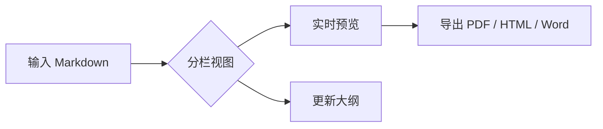
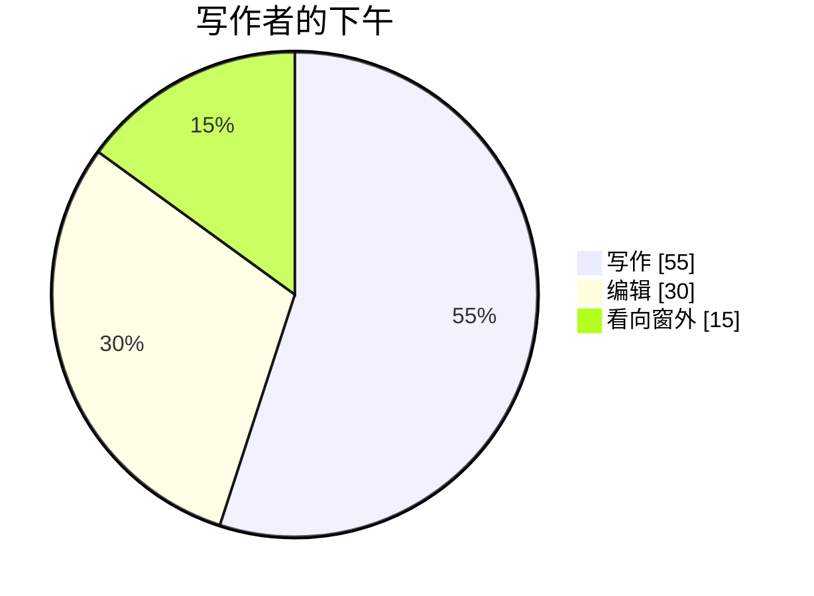

# 欢迎使用 mdtxt 👋

这是一份**真实、可编辑的文档**。这里没有截图：右侧看到的一切都由左侧的
Markdown 实时渲染。试着修改它，观察预览如何立即更新。

> 提示：按 **Ctrl+E** 可在阅读、分栏和源码视图间切换。在分栏视图中可以一边
> 编辑一边预览，是探索本指南的最佳方式。

打开大纲（底栏的列表图标，或按 **Ctrl+Shift+O**），下方每一个标题都会变成可点击的目录项。

---

## 1. 基础格式

无需使用鼠标，也可以输入**粗体**、*斜体*、***粗斜体***、~~删除线~~和 `行内代码`。
几个常用快捷键：

- **Ctrl+B**：将选中内容设为粗体
- **Ctrl+I**：将选中内容设为斜体
- **Ctrl+K**：将选中内容转换为链接

> 引用块很适合补充说明、提示和引用内容。

1. 有序列表开箱即用。
2. 嵌套列表也一样：
   - 像这样
   - 以及这样

## 2. 任务列表

直接在笔记中跟踪完成情况。试试点击预览中的复选框：

- [x] 安装 mdtxt
- [x] 打开本指南
- [ ] 写下第一篇笔记
- [ ] 导出为 PDF

## 3. 表格

| 功能 | 快捷键 | 说明 |
| --- | --- | --- |
| 命令面板 | `Ctrl+P` | 搜索每个操作和文件 |
| 文件浏览器 | `Ctrl+Shift+E` | 浏览当前文件夹 |
| 大纲 | `Ctrl+Shift+O` | 在标题间跳转 |
| 全局搜索 | `Ctrl+Shift+F` | 在文件夹内查找文本 |

## 4. 带语法高亮的代码

围栏代码块会按语言高亮，预览中的每个代码块都有复制按钮。

```js
function greet(name) {
  // mdtxt 会自动高亮这里
  return `你好，${name}！欢迎使用。`;
}

console.log(greet("写作者"));
```

## 5. 数学公式

mdtxt 使用 KaTeX 渲染 LaTeX 数学公式。可以输入行内公式 $E = mc^2$，或在
双美元符号间输入二次方程公式：

$$
x = \frac{-b \pm \sqrt{b^2 - 4ac}}{2a}
$$

它同样支持求和、积分和矩阵：

$$
\int_{0}^{\infty} e^{-x^2}\,dx = \frac{\sqrt{\pi}}{2}
\qquad
A = \begin{bmatrix} 1 & 0 \\ 0 & 1 \end{bmatrix}
$$

通过 `mhchem` 扩展也可以书写化学公式：

$$
\ce{CO2 + C -> 2 CO}
$$

## 6. Mermaid 图表

将围栏代码块标为 `mermaid`，即可生成图表。下面是笔记在 mdtxt 中的流程图：



再看一个写作时间分布图：



## 7. 脚注与链接

可以使用脚注引用来源[^1]，也可以链接到任何内容，例如
[Markdown 指南](https://www.markdownguide.org)。

自己笔记之间的内部链接使用 Wiki 风格语法。输入 `[[另一篇笔记]]` 会链接到同一
文件夹内的文件；输入 `[[` 时 mdtxt 还会自动补全文件名。

[^1]: 脚注会显示在这里，上方的引用会链接到它。

---

## 接下来做什么？

- 按 **Ctrl+P** 后输入内容，可立即前往任意命令。
- 将图片拖入编辑器，mdtxt 会把它保存到笔记旁。
- 在齿轮菜单中选择主题（深色、浅色、纸张或 Dracula）。

工具就这些。随时删除这一页的全部内容，开始写下自己的文字吧。祝你写作愉快！🚀
